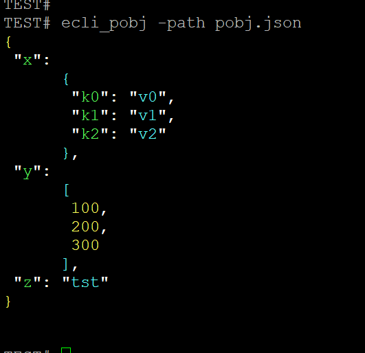
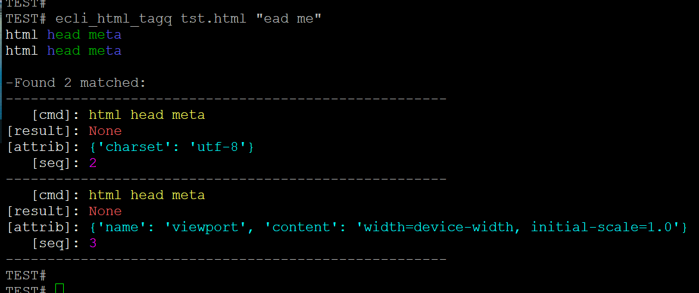
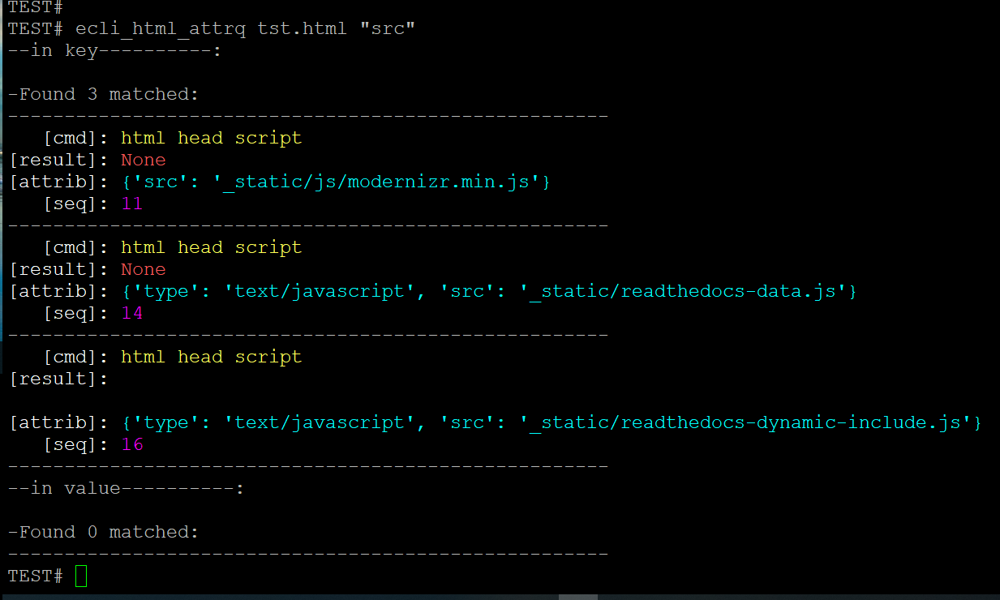
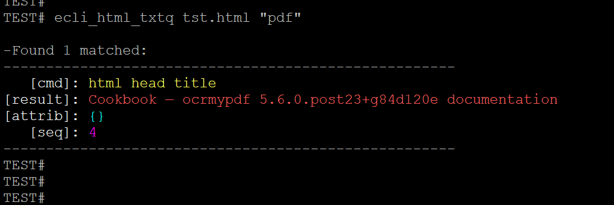

.. contents:: Table of Contents
   :depth: 5

*ecli*
------------

Installation
============

    ::
    
        $ pip3 install ecli

Usage
=====
    
CLI    
^^^

ecli_jsonq
##########

- ecli_jsonq json-file key key key .....

loosely
~~~~~~~
    
    ::
        
        #loosely search
        #ecli_jsonq nest.json display
        
.. image:: docs/jsonq-loose.png

exactly
~~~~~~~

    ::
        
        #exact search 
        #ecli_jsonq nest.json Displays 0

.. image:: docs/jsonq-exact.png

listall
~~~~~~~~
    
    ::
        
        #listall 
        #ecli_jsonq nest.json

.. image:: docs/jsonq-listall.png

ecli_pobj
#########
    
    ::
        
         #ecli_pobj -path pobj.json

ecli_htmlq
##########

ecli_html_tagq
~~~~~~~~~~~~~~
    
    ::
        
        #ecli_html_tagq tst.html "ead me"

ecli_html_attrq
~~~~~~~~~~~~~~~
    
    ::
        
        #ecli_html_attrq tst.html "src"

ecli_html_txtq
~~~~~~~~~~~~~~~
    
    ::
        
        #ecli_html_txtq tst.html "pdf"

License
=======

- MIT
