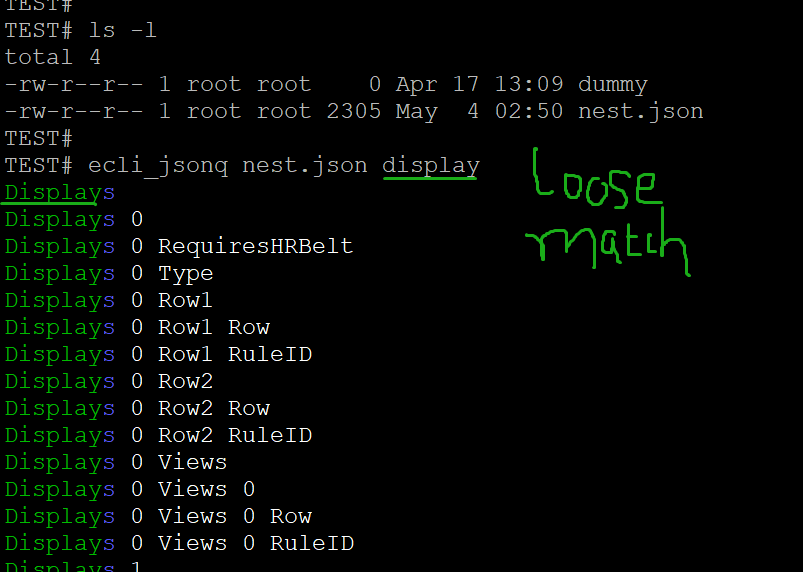
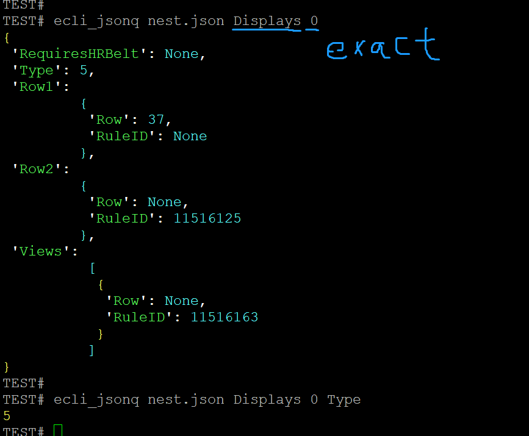
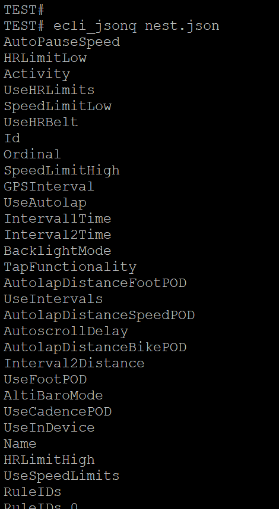

.. contents:: Table of Contents
   :depth: 5

*ecli*
------------

Installation
============

    ::
    
        $ pip3 install ecli

Usage
=====
    
CLI    
^^^

ecli_jsonq
##########

- ecli_jsonq json-file key key key .....

loosely
~~~~~~~
    
    ::
        
        #loosely search
        #ecli_jsonq nest.json display
        

exactly
~~~~~~~

    ::
        
        #exact search 
        #ecli_jsonq nest.json Displays 0

listall
~~~~~~~~
    
    ::
        
        #listall 
        #ecli_jsonq nest.json

License
=======

- MIT
